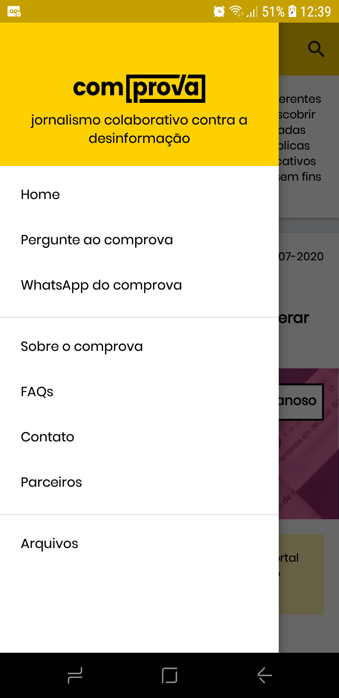
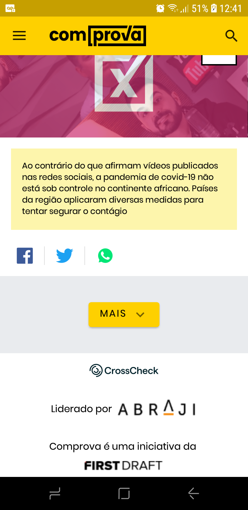

 # Projeto Comprova App
 
         

 ---
 
 # Sobre o projeto
App feito para o [Projeto Comprova](https://projetocomprova.com.br/), uma iniciativa sem fins lucrativos idealizada e desenvolvida pelo [First Draft](https://firstdraftnews.org/) com a colaboração da [Abraji](https://abraji.org.br/) e apoio do [Google News Initiative](https://newsinitiative.withgoogle.com/intl/pt_br/) e [Facebook's Journalism Project](https://pt-br.facebook.com/journalismproject).
O Projeto Comprova reúne jornalistas de 28 diferentes veículos de comunicação brasileiros. Para saber mais sobre o comprova acesse [aqui](https://projetocomprova.com.br/about/).

A ideia central do app é o usuário ter em mãos uma poderosa ferramenta contra Fake News, visto que quase a totalidade das notícias falsas são repassadas via celular e a maioria das pessoas que repassam essas notícias tem apenas o celular com fonte de acesso à internet e comunicação. É claro que o site do comprova pode ser facilmente acessado via navegador no celular, porém, com o app instalado, o usuário: 
* pode facilmente compartilhar um artigo desmentindo uma fake news
* vai se manter engajado e trazer mais visibilidade aos artigos 
* ser avisado constantemente(a cada 3 dias via notificação) sobre as últimas fakes news que circulam nas redes sociais.

## Construído com
* biblioteca [Jsoup](https://jsoup.org/) para fazer o Parse e Scrap do conteúdo dos artigos do Comprova, devido ao fato de não se ter uma API para intermediar o acesso ao BD
* Picasso para fazer o load das imagens
* SpannableString e WebView para gerenciar os links presentes nos artigos
* WorkManager biblioteca presente no Android [JetPack](https://developer.android.com/jetpack) para implementar as notificações

## Instale o App

## Funcionalidades 
Para se ter acesso a todo o conteúdo do app basta acessar o menu de navegação no canto superior esquerdo. Assim você poderá:
* ver uma lista dos últimos artigos disponibilizados e acessá-los
* enviar um formulário de pergunta ao comprova
* entrar em contato com o comprova através do WhatsApp, Facebook, Twitter ou email
* saber mais sobre o comprova e ler as perguntas frequentes
* consultar todos os parceiros do projeto comprova
 
 ## Observações
* o app está em fase inicial e não está disponibilizado no Google Play
* o menu "arquivos" e o botão de pesquisa ainda não estão implementados
 
 ## Notificação
 
 
